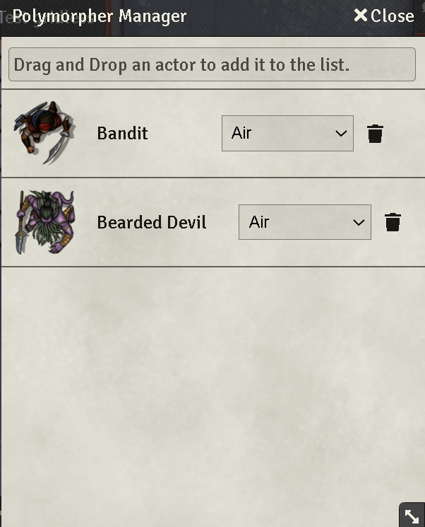
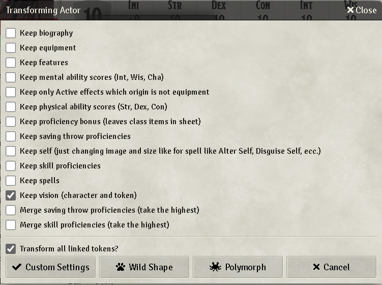

#  FoundryVTT Automated Polymorpher

 

[](https://forge-vtt.com/bazaar#package=foundryvtt-automated-polymorpher) 


[](https://www.foundryvtt-hub.com/package/foundryvtt-automated-polymorpher/)

### If you want to buy me a coffee [](https://www.patreon.com/p4535992)

A user interface to manage the polymorph feature of Dnd5e with summoning animations.

**Note: This is module is inspired from the  wonderful work done by [theRipper93](https://github.com/theripper93) with its [automated-evocations](https://github.com/theripper93/automated-evocations) module.
If you want to support more modules of this kind, I invite you to go and support his patreon**

[](https://www.patreon.com/theripper93) [](https://discord.gg/F53gBjR97G)

Should work with all system supported from the [warpgate](https://github.com/trioderegion/warpgate) module "mutate" function, but for now the module is only used and tested with the Dnd5e system and the polymorph mechanism.

## NOTE: If you are a javascript developer and not a typescript developer, you can just use the javascript files under the dist folder

## Known issue/Limitation

## Installation

It's always easiest to install modules from the in game add-on browser.

To install this module manually:
1.  Inside the Foundry "Configuration and Setup" screen, click "Add-on Modules"
2.  Click "Install Module"
3.  In the "Manifest URL" field, paste the following url:
`https://raw.githubusercontent.com/p4535992/foundryvtt-automated-polymorpher/master/src/module.json`
4.  Click 'Install' and wait for installation to complete
5.  Don't forget to enable the module in game using the "Manage Module" button

### sequencer

This module uses the [sequencer](https://github.com/fantasycalendar/FoundryVTT-Sequencer/) library. It is a hard dependency.

### warpgate

This module uses the [warpgate](https://github.com/trioderegion/warpgate) library. It is a mandatory dependency and it is recommended for the best experience and compatibility with other modules.

### advanced-macros

This module uses the [advanced-macros](https://github.com/League-of-Foundry-Developers/fvtt-advanced-macros) library. It is a optional dependency and it is recommended for the best experience and compatibility with other modules.

**NOTE: you need this only for the custom macro feature, i don't suggest it is much easier to create the actors and set them up, with the drag and drop but it's up to you**

## Features 

Open any character sheet, in the header of the window you will see the polymorphers button


Upon opening you will be welcomed by a window, from here you can drag and drop actor into it to add them.

After adding actor to the window you will have some options:

- To mutate click on the actor image
- The dropdown will let you chose the summoning animation



Then you interact with the standard panel of the Polymorph (if the system is dnd5e)



## Store polymorphers on actor

By default polymorphers are stored per user (so each actor will have the same summon list). If you want a particular actor to have it's own summon list you can use the included macro to switch the actor from global storage to local (on the actor). Simply place a linked actor on the scene, select it and run the macro. Using the other macro to switch it to global again will not wipe the saved polymorphers so setting it to local at a later date will restore the previous list.

For more advanced users you can set the flag with the following command : `actor.setFlag(APCONSTS.MN,"isLocal", false)` (set true\false to enable disable local storage)

## Custom Macros (requires the Advanced Macro Module and a game system is not Dnd5e)

You can assign custom macros to specific actors

1. Create a macro with this exact name `AP_Polymorpher_Macro(ActorName)` eg. `AP_Polymorpher_Macro(Bat)`, this will get fired any time a creature with that name is summoned
2. Add code for the custom data, in the context of the macro args[0] contains the following data: 

`polymorpherActor`: the actor that's getting summoned

`assignedActor`: the actor assigned to the player doing the summoning (this will be the selected token actor if no assigned actor is found, this is always the case for GMs)

The macro must return the custom data.

Example (XXX auto scaling)

Macro name: `AP_Polymorpher_Macro(XXX)`

```js
return {
  Item: {
    "Clenched Fist": {
      "data.attackBonus": args[0].assignedActor?.data.data.attributes.spelldc-8+args[0].assignedActor?.data.data.bonuses.msak.attack,
      "data.damage.parts":[[`${((args[0].spellLevel || 5)-5)*2+4}d8`,"force"]]
    },
    "Grasping Hand":{
      "data.damage.parts":[[`${((args[0].spellLevel || 5)-5)*2+4}d6 + ${args[0].assignedActor?.data.data.abilities[args[0].assignedActor?.data.data.attributes.spellcasting]?.mod || ""}`,"bludgeoning"]]
    }
  }
}
```

Every time an actor named `XXX` is summoned, the custom data will be applied

# Build

## Install all packages

```bash
npm install
```
## npm build scripts

### build

will build the code and copy all necessary assets into the dist folder and make a symlink to install the result into your foundry data; create a
`foundryconfig.json` file with your Foundry Data path.

```json
{
  "dataPath": "~/.local/share/FoundryVTT/"
}
```

`build` will build and set up a symlink between `dist` and your `dataPath`.

```bash
npm run-script build
```

### NOTE:

You don't need to build the `foundryconfig.json` file you can just copy the content of the `dist` folder on the module folder under `modules` of Foundry

### build:watch

`build:watch` will build and watch for changes, rebuilding automatically.

```bash
npm run-script build:watch
```

### clean

`clean` will remove all contents in the dist folder (but keeps the link from build:install).

```bash
npm run-script clean
```
### lint and lintfix

`lint` launch the eslint process based on the configuration [here](./.eslintrc)

```bash
npm run-script lint
```

`lintfix` launch the eslint process with the fix argument

```bash
npm run-script lintfix
```

### prettier-format

`prettier-format` launch the prettier plugin based on the configuration [here](./.prettierrc)

```bash
npm run-script prettier-format
```

### package

`package` generates a zip file containing the contents of the dist folder generated previously with the `build` command. Useful for those who want to manually load the module or want to create their own release

```bash
npm run-script package
```

## [Changelog](./changelog.md)

## Issues

Any issues, bugs, or feature requests are always welcome to be reported directly to the [Issue Tracker](https://github.com/p4535992/foundryvtt-automated-polymorpher/issues ), or using the [Bug Reporter Module](https://foundryvtt.com/packages/bug-reporter/).

## License

- **Jack Kerouac's**: [GPL-3.0 License](https://github.com/jackkerouac/animated-tokens/blob/main/LICENSE)

- **JB2A**: [CC BY-NC-SA 4.0](https://github.com/Jules-Bens-Aa/JB2A_DnD5e/blob/main/License.txt)

- **Sequencer**: [Mit License](https://github.com/fantasycalendar/FoundryVTT-Sequencer/blob/master/LICENSE)

- **Warpgate**: [GPL-3.0 License](https://github.com/trioderegion/warpgate/blob/master/LICENSE)

- **Automated Evocations**: ???

- **Game Icons**: [CC BY 3.0](https://creativecommons.org/licenses/by/3.0/)

This package is under an [GPL-3.0 License](LICENSE) and the [Foundry Virtual Tabletop Limited License Agreement for module development](https://foundryvtt.com/article/license/).

## Credits

- **Jack Kerouac's**: The Fire, Air, Lightning, Water, Energy, Magic, Heart, Crescendo, Four Elements animations assets are from Jack Kerouac's amazing https://github.com/jackkerouac/animated-spell-effects-cartoon module. (used with permission)

- **JB2A**: The  Chord, Darkness, Ice, Conjuration, Storm animations assets are courtesy of JB2A (Free animated assets), i strongly reccomend checking out their patreon for many more amazing animations and variations. (used with permission) https://discord.gg/A59GAZwB9M https://www.patreon.com/JB2A

- **Sequencer**: This module is used to play the animations https://github.com/fantasycalendar/FoundryVTT-Sequencer

- **Warpgate**: This module is used for the spawning https://github.com/trioderegion/warpgate

- **Automated Evocations**: This module is used for the inspiration and base functionality https://github.com/theripper93/automated-evocations

- **Game Icons**: Some images used are from https://game-icons.net/

## Acknowledgements

Bootstrapped with League of Extraordinary FoundryVTT Developers  [foundry-vtt-types](https://github.com/League-of-Foundry-Developers/foundry-vtt-types).

Mad props to the 'League of Extraordinary FoundryVTT Developers' community which helped me figure out a lot.
